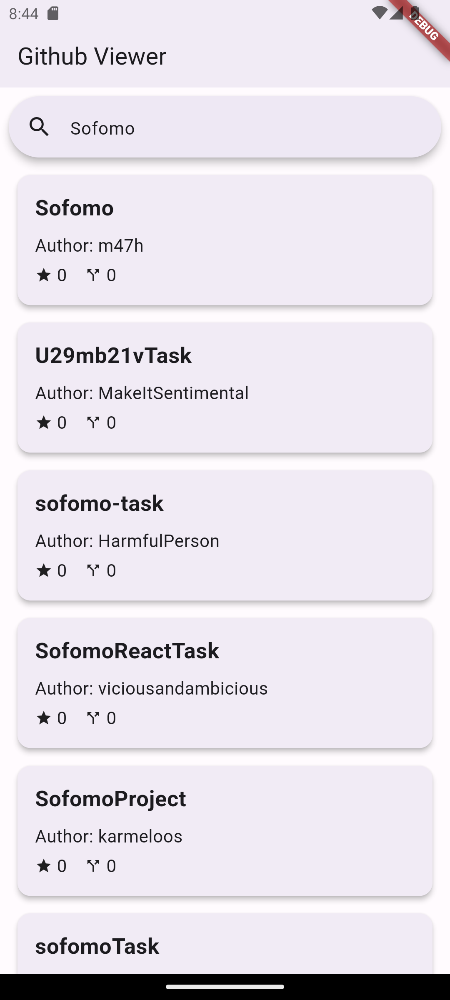
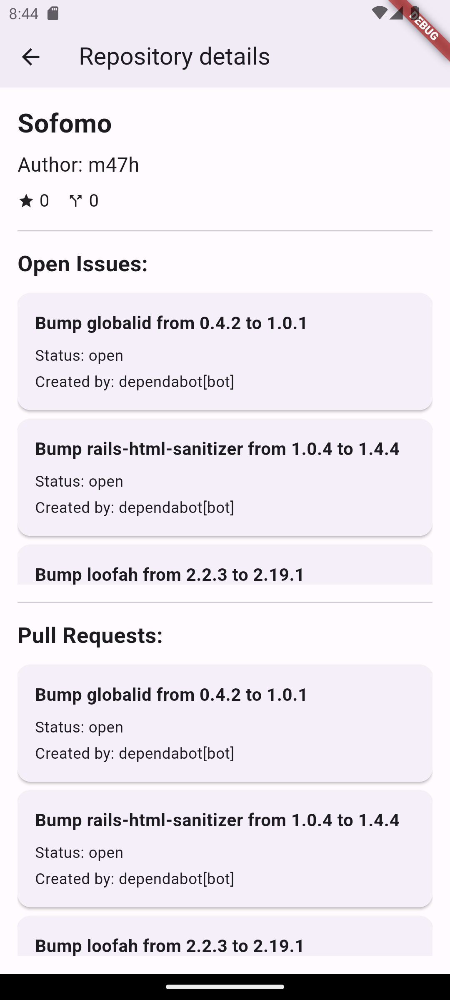

# GithubViewer

Sample github repositories explorer.

<table>
  <tr>
    <td></td>
    <td></td>
    <td></td>
  </tr>
 </table>

## How to run

Create .env file in main folder with constant value like this:

API_KEY=YOUR_API_KEY